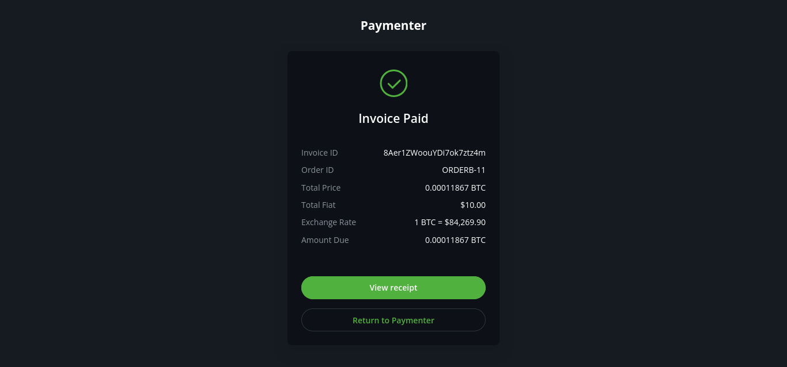
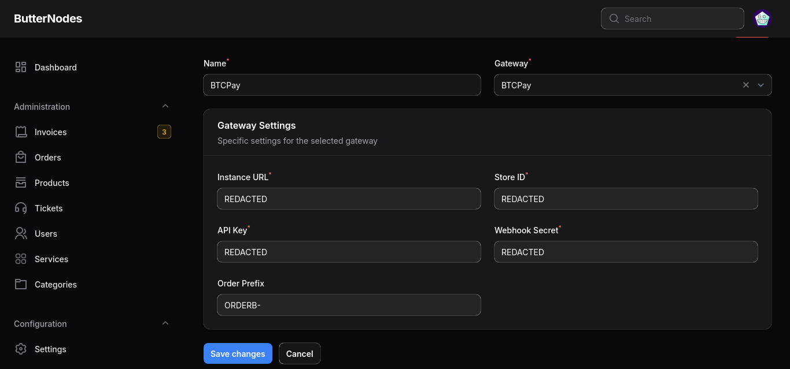

# BTCPay Server Payment Gateway for Paymenter  

  

A simple extension to integrate [BTCPay Server](https://btcpayserver.org) as a payment gateway within Paymenter, allowing you to accept cryptocurrency payments seamlessly and securely.  

## Supported Versions
- **Supported Version:** Paymenter V1 Beta  
- **Extension Version:** v1.0.0

## Features  
- Accept Bitcoin (BTC) and other cryptocurrencies via BTCPay Server.  
- Fully self-hosted payment processing for better privacy & security.  
- Automatic invoice processing via webhooks.  
- Custom Order Prefix support for better tracking.  
- Secure transactions using BTCPay API Key & Webhook Secret.

## Getting Started  

1. **Install the extension**  
   - Replace `/var/www/paymenter` with your Paymenter root if it is different.  
   - **One-liner Install:**  
     ```sh
     git clone https://github.com/VaibhavSys/BTCPay-Paymenter.git /var/www/paymenter/extensions/Gateways/BTCPay
     ```
   - **Manual Install:**  
     [Download](https://github.com/VaibhavSys/BTCPay-Paymenter/releases/latest/download/BTCPay.zip) the extension and extract it to:  
     ```
     /var/www/paymenter/extensions/Gateways
     ```
1. Enable the extension from the Paymenter admin panel.
1. Set up a webhook for **InvoiceSettled** (An invoice has been settled) event on `https://your-paymenter.url/extensions/btcpay/webhook`
1. Configure your BTCPay Server credentials and settings (see below).
1. Start accepting crypto payments via BTCPay Server!




## Configuration

To set up the extension, enter the following details in the Paymenter admin panel:  

- **Instance URL:** Your BTCPay Server instance URL (e.g., `https://btcpay.example.com`). Ensure no trailing slash.
- **Store ID:** Your BTCPay Store ID.  
- **API Key:** API Key from BTCPay Server with the following required permissions:  
  - `btcpay.store.canviewinvoices`  
  - `btcpay.store.cancreateinvoice`
- **Webhook Secret:** Webhook secret used to verify payment notifications. This should match the one configured in BTCPay Server.
  Set up a webhook for **InvoiceSettled** (An invoice has been settled) event on `https://your-paymenter.url/extensions/btcpay/webhook`
- **Order Prefix (optional):** Prefix added before the order ID (e.g. `ORDER-10`).  

> **Note:** Ensure that the webhook is properly configured in your BTCPay Server to enable automatic invoice marking.



## Security Notice  

This extension requires sensitive information, including:  
- BTCPay API Key  
- Webhook Secret  

To keep your transactions secure:  
- Always store these credentials securely and confidentially.

## Support  

For assistance, please reach out:  
- **Discord:** [@vaibhavd](https://discord.com/users/914452175839723550)  
- **GitHub Issues:** [BTCPay-Paymenter Issues](https://github.com/VaibhavSys/BTCPay-Paymenter/issues)

## Additional Information  

- **License:** This is an open-source extension licensed under the [MIT License](LICENSE).  
- The BTCPay Server name and logo are owned by BTCPay Server. This project is not affiliated with or endorsed by BTCPay Server.
